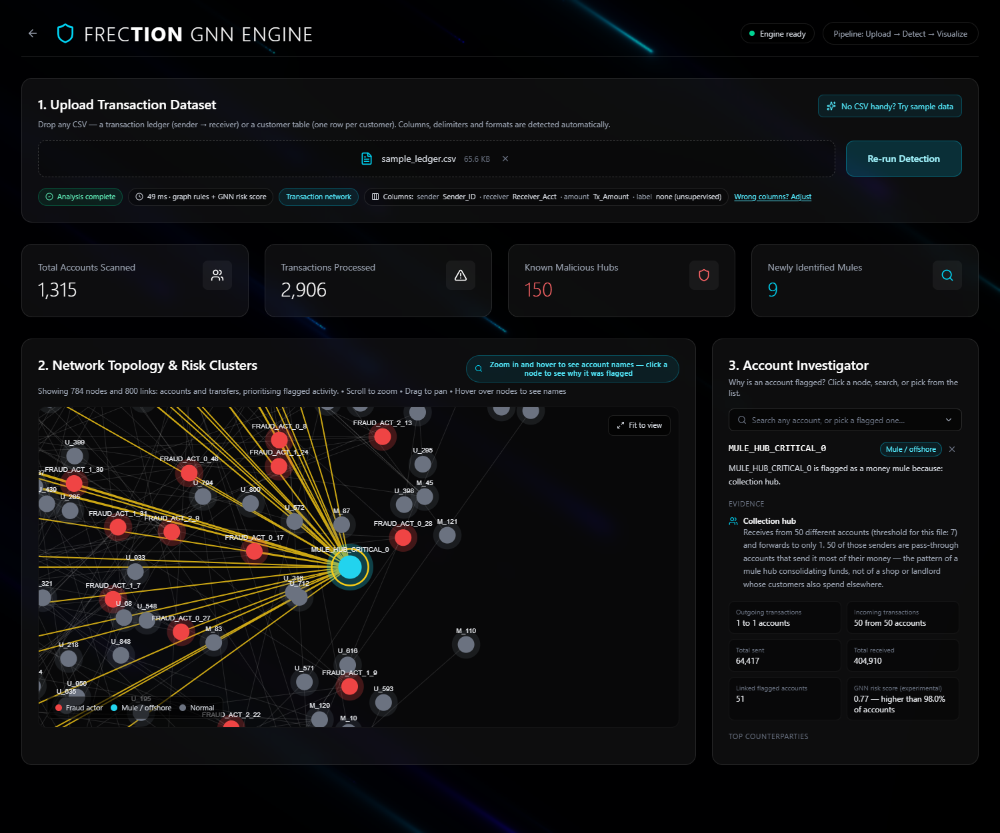
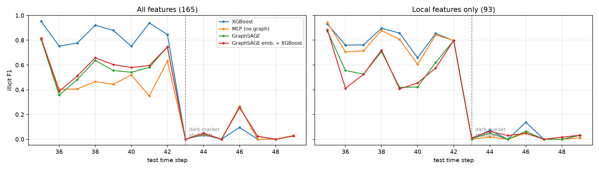

# FRECTION — fraud-ring detection on transaction graphs

FRECTION finds coordinated fraud rings in financial data. Instead of scoring
each transaction on its own, it models accounts as a graph, flags fraud actors
and mule accounts from the structure of the money flow, draws the network, and
explains every verdict.

Upload a CSV, see the ring, click an account, read why it was flagged.



## What it does

- **Reads almost any CSV.** Columns, delimiter and encoding are detected
  automatically, and you can correct the detection in the UI.
- **Handles two kinds of data.**
  - *Transaction ledgers* (sender → receiver): accounts become nodes, transfers
    become edges, and rings are found from the shape of the money flow.
  - *Customer tables* (one row per customer): anomaly detection plus a
    similarity graph that links each customer to its closest look-alikes.
- **Explains every verdict.** Click a node, search, or pick a flagged account
  to see the evidence behind its label and its counterparties.
- **Optional AI summary.** With an Anthropic API key, Claude writes a short
  investigator-style summary of that evidence and answers follow-up questions.
- **Scores every account with a GNN.** An inductive GraphSAGE model, trained
  without label leakage, runs on the uploaded graph and adds a risk score as
  supporting evidence.
- **Fast.** 100,000 transactions are analysed in well under a second.

## Results

### Detection rules, against known ground truth

Scored on synthetic ledgers where the true fraud accounts are known
(`python -m tests.rule_benchmark`).

| Dataset | Accounts | Truly bad | Flagged | Precision | Recall |
|---|---|---|---|---|---|
| Bundled sample | 1,315 | 159 | 159 | 100 % | 100 % |
| Neutral names, with shops, landlords and employers | 4,701 | 376 | 376 | 100 % | 100 % |
| Messy: fraud actors who also shop, franchise outlets, rings with no actor layer | 4,563 | 222 | 214 | 100 % | 96 % |

An earlier version of the rules flagged nearly every account on these ledgers
(4–15 % precision). The before/after comparison is in
[`reports/rule_benchmark.md`](reports/rule_benchmark.md).

These ledgers are synthetic and share the rules' own idea of what a ring looks
like. The table shows the rules do what they were designed to do. It is not
evidence of performance on real bank data.

### Does a graph neural network help? An honest benchmark

The GraphSAGE encoder in this repo was benchmarked against tabular baselines on
the [Elliptic Bitcoin dataset](https://www.kaggle.com/datasets/ellipticco/elliptic-data-set)
(203,769 real transactions, 4,545 labelled illicit).

Protocol: temporal split (train on time steps 1–29, validate on 30–34, test on
35–49), scaling fitted on the training period only, decision threshold chosen on
validation, three seeds. Scores are for the illicit class on the test period.

| Model | Precision | Recall | F1 | PR-AUC |
|---|---|---|---|---|
| **Random Forest** | 0.895 | 0.714 | **0.794** | 0.787 |
| XGBoost | 0.781 | 0.735 | 0.756 | 0.789 |
| GraphSAGE embeddings + XGBoost | 0.580 | 0.585 | 0.581 | 0.617 |
| GraphSAGE | 0.571 | 0.569 | 0.569 | 0.518 |
| MLP (same features, no graph) | 0.488 | 0.480 | 0.482 | 0.314 |
| Logistic Regression | 0.171 | 0.780 | 0.281 | 0.219 |

**Finding: the graph model did not beat the tree baselines.** A random forest on
the tabular features reached 0.79 F1; GraphSAGE reached 0.57. This agrees with
the dataset authors' own result, where random forest also outperformed a GCN.
GraphSAGE was run in one configuration and is not tuned.



Every model collapses after time step 43, when a dark market shut down and the
pattern of illicit activity changed. A model trained on the past stops working
when behaviour changes, whether or not it uses the graph.

Full tables, including the local-features-only run:
[`reports/elliptic_results.md`](reports/elliptic_results.md).
Reproduce with `python -m src.evaluation.evaluate_elliptic --data-dir <elliptic folder>`.

### Inductive GraphSAGE on PaySim, without label leakage

Task: predict which accounts receive fraud-labelled money, from structure and
amounts only. PaySim is cut into time windows and each window is a separate
graph, so the model is tested on graphs it has never seen. Three seeds.

| Window | Base rate | Model | PR-AUC | Precision@100 |
|---|---|---|---|---|
| Test (steps 239–306) | 0.11 % | XGBoost, same features, no graph | 0.016 | 0.15 |
| | | **GraphSAGE (inductive)** | **0.021** | 0.15 |
| Late (steps 373–743) | 0.53 % | XGBoost, same features, no graph | 0.094 | 0.80 |
| | | **GraphSAGE (inductive)** | **0.132** | 0.85 |

Here the graph helps: GraphSAGE is 35–40 % ahead of XGBoost on the same
features. The absolute scores are low, and that is the honest picture. An
earlier version of this pipeline used per-account fraud counts as features,
which leaked the label and drove the training loss to almost zero. With the
leak removed, structure and amounts alone identify few of PaySim's fraud
receivers.

This is the model the app runs on uploads. Applied unchanged to the synthetic
ring ledgers, it ranks cash-out accounts in the top 1 % but does not rank
collection hubs highly, because in PaySim an account with many receipts is
ordinary. That is why the rules, not the model, decide the verdicts.

Details: [`reports/paysim_inductive.md`](reports/paysim_inductive.md).
Reproduce with `python -m src.training.train_inductive --paysim <paysim.csv>`.

## How it works

```
CSV upload
   │
   ▼
ingest          detect encoding, delimiter and column roles; clean the table
   │
   ├── transactions ──▶ graph rules: collection hubs, feeders, layering
   │                    + inductive GraphSAGE risk score per account
   │
   └── customer table ─▶ robust scaling → Isolation Forest → k-NN similarity graph
   │
   ▼
evidence store ──▶ account investigator: rule-by-rule explanation, optional AI summary
   │
   ▼
React dashboard: force-directed network, metrics, column editor
```

**Transaction rules.** Labels are used where they exist; otherwise the rules use
graph structure only. Nothing is matched on account names.

- A **collection hub** receives from many accounts, forwards to one to three,
  and is fed mainly by pass-through accounts that send it most of their money.
  That last condition separates a mule hub from a shop or a landlord.
- **Layering** follows the money downstream: an account funded mainly by mules
  is a mule (hub → shell → offshore).
- **Fraud actors** are the pass-through accounts that feed a confirmed hub.

A module-by-module explanation, with the reasoning and limits of each part, is
in [`docs/WALKTHROUGH.md`](docs/WALKTHROUGH.md).

## Quick start

Requirements: Python 3.10+ and Node.js 20+.

```bash
git clone https://github.com/inslot2525-ctrl/FRECTION
cd FRECTION

python -m venv .venv
.venv\Scripts\activate            # Windows   (macOS/Linux: source .venv/bin/activate)
pip install -r requirements.txt

cd dashboard/frontend
npm install
cd ../..
```

Run it:

```bash
.\start.ps1                       # Windows: starts backend and frontend
```

or in two terminals:

```bash
uvicorn api.main:app --port 8000
cd dashboard/frontend && npm run dev
```

Open http://localhost:5173 and click **Try sample data**, or go straight to
http://localhost:5173/detect?demo=1&account=MULE_HUB_CRITICAL_0.

`requirements.txt` installs everything, including PyTorch for the GNN score,
training and tests. To run only the app, `requirements-app.txt` is enough; the
GNN score is then skipped and everything else works.

Run the tests with `pytest`. To deploy, see [`docs/DEPLOY.md`](docs/DEPLOY.md).

**Optional AI summaries.** Copy `.env.example` to `.env` and add your
`ANTHROPIC_API_KEY`. Only the evidence for the account you are viewing is sent,
never the uploaded file. Everything else works without a key.

## Project structure

```
api/
  main.py            FastAPI app, transaction rules, endpoints
  ingest.py          CSV reading, cleaning, column detection
  entities.py        customer-table mode: Isolation Forest + k-NN graph
  explain.py         account investigator and optional AI summary
  gnn.py             runs the trained GraphSAGE on an uploaded graph
dashboard/frontend/  React + Vite dashboard
models/              trained inductive GraphSAGE (45 KB)
src/
  features.py        leak-free account features, shared by training and the app
  models/            GraphSAGE encoder, edge decoder, node risk model
  training/          train_inductive.py (current), train_gnn.py (edge model)
  preprocessing/     PaySim → graph tensors for the edge model
  evaluation/        Elliptic benchmark
  legacy/            earlier experiments, not used by the app
tests/               23 tests: ingestion, rules, API, GNN
reports/             benchmark results
docs/                walkthrough and deployment guide
Dockerfile           one container: API + built dashboard
```

## Limitations

- **The GNN score does not decide verdicts.** It is trained on PaySim, where
  fraud receivers take one large transfer, so it does not recognise collection
  hubs. The rules decide; the score is supporting evidence.
- **The GNN's absolute accuracy is low** (PR-AUC 0.02–0.13 on PaySim).
- **The rule scores are on synthetic data** and the thresholds are hand-picked.
- **Rings with no fraud-actor layer are missed.** Victims paying a hub directly
  look the same as customers paying a business.
- **Single process, in memory.** Uploads are capped at 100,000 rows and analysis
  results are lost on restart.
- **The Docker image has not been test-built** on the development machine.

## Roadmap

- Train the risk model on data with real ring structure (for example IBM's AML
  dataset) so it can learn hubs, then let it inform verdicts
- Tune GraphSAGE on Elliptic and try out-of-fold embeddings for the hybrid model
- Learn the rule thresholds from data
- Hosted demo

## Tech stack

Python · FastAPI · pandas · NumPy · scikit-learn · XGBoost · PyTorch ·
PyTorch Geometric · React · Vite · Tailwind CSS · react-force-graph · three.js · Docker

## License

MIT
